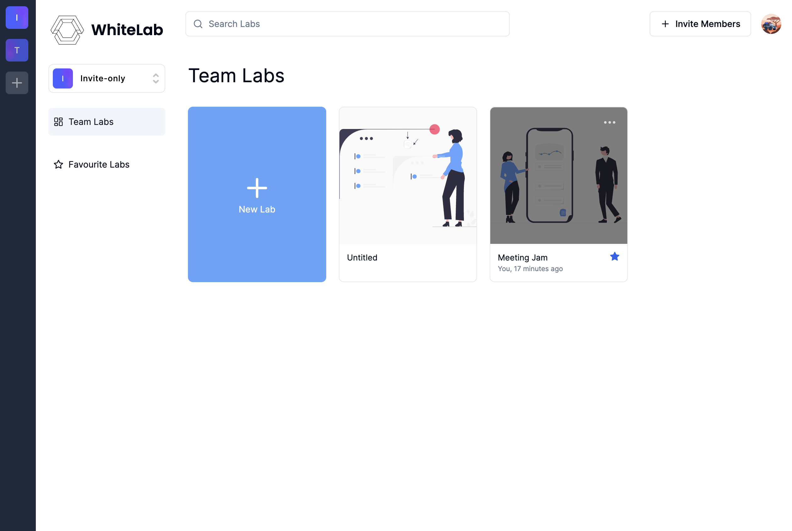
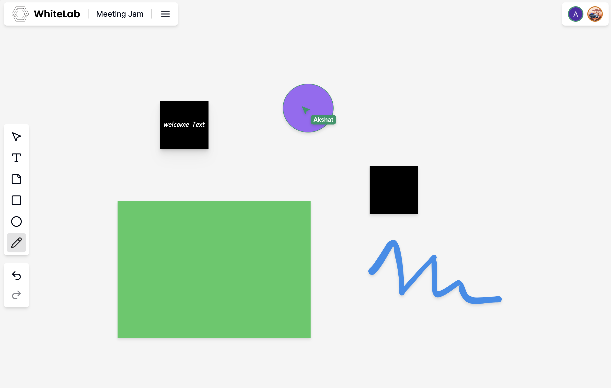

## WhiteLab

A live whiteboard collaboration website. 
This is a clone of Miro, built while learning from a youtube tutorial.

Deployed at: https://live-whiteboard-collab.vercel.app

### Features

- User Authentication
- Create & Manage Organizations
- Invite Members
- Create New Labs
- Monitor Other Members' Actions
- CRUD working on Labs

### Tech Stack

- Next 14
- Clerk Auth
- ShadcnUI
- Convex DB
- Liveblocks

### Screenshots

